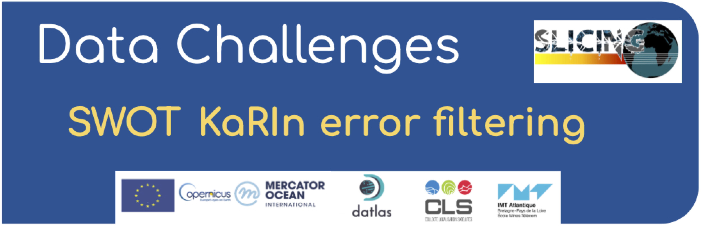

# SWOT karin error filtering 2022a
A challenge on the SWOT Karin instrumental error filtering organised by Datlas, IMT Altlantique and CLS.

Intercompare uncorrelated instrument error filtering methods 

Copernicus Marine Service Evolution 21036-COP-INNO SCI

Project:
Sea Level Innovations and Collaborative Intercomparisons for the Next-Generation products (SLICING)  

Collaborative data challenges for the next-generation sea level anomaly metrics, observation and mapping products  

## Context & Motivation

The two-dimensional sea level SWOT data are very much expected to be a game changer in many oceanographic applications which will make them an unprecedented L3 product to be distributed. The row SWOT data will however be contaminated by instrumental and geophysical errors (Gauthier et al., 2016 ; Peral and Esteban-Fernandez, 2018). In order to be able to observe front, mesoscale and sub-mesoscale features the SWOT data will require specific processing. Also, these errors are expected to strongly pollute the second derivatives of the SSH data which are used for the computation of geostrophic currents. Hence, being able to remove the SWOT errors will be of significant importance to recover information on 2D surface currents and vertical mixing.  

The SWOT errors are expected to generate noises that are both correlated on the swath and spatially uncorrelated. Several past efforts have already investigated methods to remove or reduce the correlated noises from the SWOT data using prior knowledge on the ocean state (e.g. Metref et al., 2019, see Figure 2.4.A), calibration from independent Nadir altimeter data (e.g. Febvre et al., 2021, see Figure 2.4.B) or cross-calibration from SWOT data themselves (on-going CNES-DUACS studies). And other efforts focused on reducing the uncorrelated data (Gomez-Navarro et al., 2018, 2020; Febvre et al., 2021). Yet, so far, no rigorous intercomparison between the recently developed methods has been undertaken and it seems difficult, to this day, to outline the benefits and limitations of favoring one error reduction method from another.  

SWOT product and requirement

## Observations

Simuated SWOT track

The noisy SWOT data to filter (inputs) and their equivalent noise-free SWOT data for evaluation (targets) are hosted and available for download on the MEOM opendap server: see **Download the data** section below.
In no way the targets that are available during the evaluation period should be used in the filtering process (including for tuning the filter).   

## Data sequence and use

## Data format

## Leaderboard

## Quickstart

## Download the data

## Acknowledgement

This data challenge was created as part of the Service Evolution CMEMS project: SLICING, in collaboration with Datlas, CLS, IMT-Atlantique.

The structure of this data challenge was to a large extent inspired by the [`ocean-data-challenges`](https://github.com/ocean-data-challenges) created for the BOOST-SWOT ANR project.

The experiment proposed and the illustrative figures contained in this data challenge are based on an internal study conducted at CLS.

